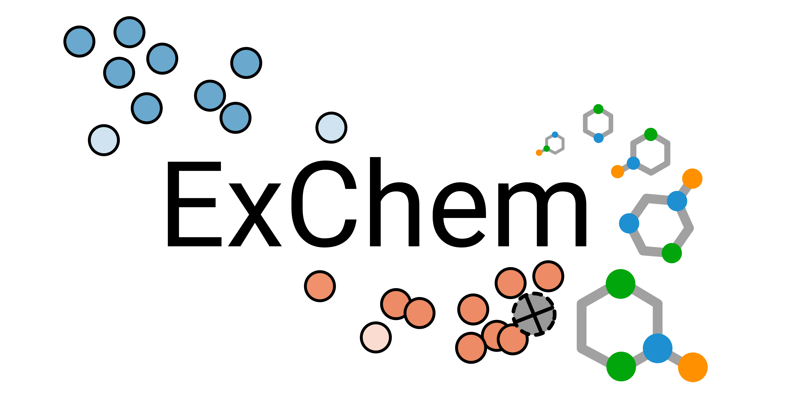

## What is ExChem?
 
Searching for structure-property relationships is an effective approach to predict yet unknown material properties.
*ExChem* allows the exploration of vast areas of chemical space by combining machine learning methods with comprehensive molecular
databases.

### Example: Magnesium Dissolution Modulators4

Small organic molecules that form complexes with corrosive species accelerating the degradation process have shown great 
potential to control the dissolution properties of pure magnesium (Mg) materials and its alloys.1
However, as the chemical space of small organic molecules is effectively infinite, the most challenging task is to find molecules 
with beneficial properties for specific applications.
Fortunately, recent studies based on a comprehensive database of magnesium dissolution modulators1 
revealed that for CPMg220 (commercial purity Mg, containing 220 ppm iron impurities) the molecular structure 
correlates well with the corrosion inhibition efficiency (IE).2,3

To further explore the structure-property relationships in magnesium dissolution modulators, a structure-property landscape was generated
using a [SOAP kernel](https://www.ncbi.nlm.nih.gov/pmc/articles/PMC5729016/) and [sketch-map](https://sketchmap.org/) for 152 compounds, 
of which 78 have already been experimentally tested1. On this basis, a kernel ridge regression (KRR) model was trained and used to
predict the IEs for a second database of over 7000 commercially available chemicals. Computation of a second SOAP kernel combining both databases
allows to screen large areas of chemical space for similar structures based on a selected compound of interest, thus facilitating
the search for new corrosion inhibitors.

*Note: For some compounds duplicates exist in the reference database. However, due to the training error of the KRR model
it may happen that experimental and predicted IEs do not match, although the structures are identical.*

### How To Use

Selection of a point in the sketch-map leads to visualization of the corresponding molecular structure in the dataset. 
Additionally, structures similar to the selected are presented in a table 
along with their CAS number, similarity value and KRR-predicted IE.  
Selecting a table row of interest leads to visualization 
of the according molecular structure and its [SMILES](https://en.wikipedia.org/wiki/Simplified_molecular-input_line-entry_system) string.
Atoms are colored according to the CPK coloring scheme.

### References

[[1] Lamaka *et al.*, Comprehensive screening of Mg corrosion inhibitors, *Corrosion Science* **128** 224–240 (2017)](https://www.sciencedirect.com/science/article/abs/pii/S0010938X17303931)  
[[2] Würger *et al.*, Data Science Based Mg Corrosion Engineering, *Frontiers in Materials* **6** 53 (2019)](https://doi.org/10.3389/fmats.2019.00053)   
[[3] Feiler *et al.*, In silico Screening of Modulators of Magnesium Dissolution, *Corrosion Science* 108245 (2020)](https://doi.org/10.1016/j.corsci.2019.108245)  
\[4\] Würger *et al.*, Exploring Structure-Property Relationships in Magnesium Dissolution Modulators, *accepted * (2020)
